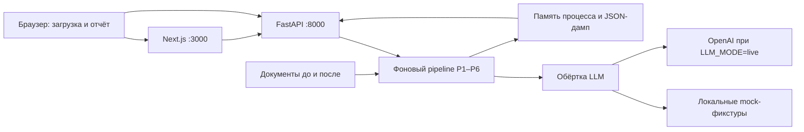

# 1. Название проекта

**ОргДифф — ИИ-агент анализа организационной структуры и функционала.**

Прототип для кейса 11 HackAlem AI, 23.09.2026. Требования организаторов: [кейс](docs/case.md), проектная логика: [спецификация](docs/spec-case11.md).

**Состояние проверенной версии:** тестовый комплект без ключа проходит до `done`, все шаги выполнены. В итоговом прогоне: 6 изменений подразделений, 209 сопоставлений, 2 подтверждённые потери, ещё 3 кандидата требуют проверки, 12 подтверждённых дублей и 0 конфликтов интересов. Заключение и скачивание Markdown доступны. Версия для воспроизведения — тег `green-17`.

## 2. Краткое описание

ОргДифф помогает сотруднику, анализирующему реорганизацию, сравнить положения о подразделениях, должностные инструкции и приложения к приказам в редакциях «до» и «после». Он собирает изменения в один отчёт и связывает находки с пунктами исходных документов, чтобы сотрудник мог проверить распределение функций и ответственности.

Выводы носят рекомендательный характер и требуют проверки ответственным сотрудником.

## 3. Что реализовано

В порядке пяти обязательных условий кейса:

1. **Изменения подразделений.** Извлечение и сопоставление подразделений со статусами «сохранено», «преобразовано», «создано», «упразднено». На тестовом комплекте доступны сохранённые и созданные подразделения, а также преобразованное направление. Статус относится к сравнению текстов документов и сам по себе не устанавливает дату или юридический факт реорганизации.
2. **Сопоставление функций и возможные потери.** Таблица функций «до»/«после», изменения исполнителя, связи один-ко-многим, отдельные ограничения и кандидаты в потери. Точное совпадение проверяется кодом с учётом контекста и исполнителя; остальные сопоставления требуют языковой проверки. В итоговом mock-прогоне подтверждены две потери; ещё три кандидата требуют проверки специалистом.
3. **Дублирование и конфликты интересов.** Поиск пересечений между подразделениями версии «после», проверка действия, объекта и исполнителей; правила разделения исполнения и контроля. Интерфейс отделяет подтверждённые находки от кандидатов. В контрольном прогоне подтверждены 12 дублей. Правила не нашли кандидатов в конфликт интересов: на демо их 0; это не доказательство отсутствия любых конфликтов в документах.
4. **Подтверждающий источник.** У находок есть документ, редакция, пункт и цитата. Оркестратор проверяет существование источника и соответствие цитаты тексту; находки с неподтверждённым источником отбрасываются. Кнопка с номером пункта открывает панель источника.
5. **Аналитическое заключение.** Реализованы генерация по проверенным фактам, рекомендации и экспорт Markdown. На тестовом комплекте заключение сформировано, Markdown скачивается через API и кнопку в Docker-интерфейсе.

Также реализованы загрузка документов, фоновый запуск, отображение прогресса и понятные ошибки входных данных. Поддерживаются только `.docx`, не более 10 файлов суммарно и 10 МБ на файл; хотя бы один документ нужен в каждой версии.

## 4. Как работает решение

Пользователь загружает документы в зоны «До реорганизации» и «После реорганизации» либо нажимает «Тестовый комплект». Затем видит ход анализа и отчёт с вкладками «Подразделения», «Функции», «Дубли и конфликты», «Заключение».

| Шаг | Детерминированный код | Языковая модель |
|---|---|---|
| P1. Разбор | Читает Word, выделяет пункты, таблицы, контекст и модальность формулировки | Не используется |
| P2. Подразделения | Готовит кандидатов, сопоставляет нормализованные названия, проверяет пункты-источники | `extract_units`, `match_units`: извлечение подразделений и разбор преобразований |
| P3. Функции | Проверяет источники, отделяет запреты от функций, вычисляет сигнатуры | `extract_functions`: атомарные функции, исполнитель, категория и контекст |
| P4. Сопоставление и дубли | BM25, сигнатуры, объединение рангов; точное сравнение текста с проверкой контекста и исполнителя; поиск по всему документу при возможной потере | `verify_matches`, `confirm_loss`, `verify_duplicates`: проверка смысла и распределения функций |
| P5. Конфликты | Правила несовместимых ролей, проверка общего объекта, исключение служебных и управленческих формулировок | `explain_conflict`: объяснение, серьёзность и признак проверки |
| P6. Заключение | Собирает проверенные факты, проверяет ссылки, формирует Markdown-экспорт | `write_conclusion`: заключение и рекомендации на основании переданных фактов |

Разбор по пунктам и сопоставление одинаковых текстов выполняет код. LLM используется на языковых шагах через `app/llm.py`, OpenAI Responses API и Structured Outputs со строгими JSON-схемами (`strict`). Номера пунктов, которых нет в переданных документах, отбрасываются кодом. Сигнатура и лексическая похожесть служат для отбора кандидатов, а не доказательством потери или дубля.

В `mock` вместо сетевых вызовов читаются локальные фикстуры. В `live` поиск кандидатов также может использовать OpenAI embeddings `text-embedding-3-small`; без кэша векторов в mock этот компонент пропускается.

## 5. Технологии

| Компонент | Используется в репозитории |
|---|---|
| Backend | Python 3.12; FastAPI, Pydantic, Uvicorn, python-multipart; зависимости фиксирует `backend/uv.lock` |
| Анализ | Разбор `.docx` через стандартную библиотеку Python; NumPy для поиска кандидатов; собственные правила и нормализация |
| AI | OpenAI Python SDK, Responses API, Structured Outputs; `OPENAI_MODEL=gpt-5.6-luna` по `.env.example`; необязательные embeddings |
| Frontend | TypeScript 5.9.3, Next.js 15.5.25, React 19.3.0, Tailwind CSS 4.3.3 — версии из `frontend/package-lock.json` |
| Запуск | Docker Compose; контейнеры Python 3.12 и Node.js 22; локально — uv и npm |
| Проверки | pytest, Ruff, ESLint, TypeScript, сборка Next.js |

Модель в таблице — настройка репозитория; S15 записала ответы этой модели на тестовом комплекте. Доступность модели в другом аккаунте отдельно не проверялась. Для mock ключ и доступ к OpenAI не нужны. Интернет нужен при первоначальном скачивании образов и зависимостей.

## 6. Архитектура проекта



| Каталог / модуль | Назначение |
|---|---|
| `backend/app/parse/`, `prebuilt/` | Разбор Word и подготовленные утилиты |
| `units.py`, `functions.py`, `candidates.py`, `matching.py` | Подразделения, функции и сопоставления |
| `duplicates.py`, `rules/conflicts.py` | Дубли и правила конфликтов |
| `conclusion.py`, `export_md.py` | Заключение и Markdown |
| `llm.py`, `llm_schemas.py`, `prompts/`, `mocks/` | Вызовы модели, схемы, промпты и фикстуры |
| `pipeline.py`, `routers/runs.py`, `validation.py`, `store.py` | Выполнение, API, валидация и хранение запусков |
| `frontend/app/`, `frontend/components/` | Страницы загрузки, прогресса, отчёта и панель источника |
| `data/case11/` | Обезличенные документы организаторов |

API: `POST /api/runs` принимает multipart-поля `before[]` и `after[]`; `POST /api/runs/demo` запускает комплект. `GET /api/runs/{run_id}` отдаёт состояние, `/report` — JSON-отчёт, `/clauses/{doc_id}/{clause_number}` — пункт, `/report.md` — Markdown. Интерактивное описание: [Swagger UI](http://localhost:8000/docs).

Frontend опрашивает состояние раз в 2 секунды. При `done` открывает отчёт автоматически; при `partial` предлагает «Открыть частичный отчёт»; при `error` показывает причину. Запуски находятся в памяти одного процесса и записываются в JSON в `backend/runtime/runs/`, в Docker — в именованный том `backend_runs`. После перезапуска API дампы автоматически не восстанавливаются: старые ссылки на отчёт перестают работать.

## 7. Установка и запуск

### 7.1. Требования

| Что | Требование / проверенное окружение |
|---|---|
| Git | Для клонирования репозитория |
| Основной путь | Docker Desktop с Linux-контейнерами либо Docker Engine 24+; плагин Compose 2.24+ с поддержкой необязательного `env_file` |
| Проверено с Docker | Итоговая проверка: Linux, Docker 29.1.3, Compose 2.40.3; ранее S18 проверяла Windows |
| Запасной путь | uv 0.12.17 (проверенная версия); Python 3.12 (uv может скачать его сам); Node.js 20+ и npm, в Docker используется Node.js 22 |
| Проверено без Docker | Linux: uv 0.12.17, Python 3.12.14, Node.js 24.21.0 |
| Порты | 3000 — интерфейс; 8000 — API. Настройка других портов — раздел 7.5 |
| Ресурсы | Проверочный ноутбук: 16 ГБ ОЗУ, Docker доступны около 8 ГБ. Минимальная память и пиковое потребление не измерялись. Предусмотрите место под Docker-образы, зависимости и загруженные документы; ориентир из плана запуска — 2 ГБ диска, это не измеренный минимум |

Проверка Docker:

```text
docker --version
docker compose version
```

Перед запуском должен работать Docker Desktop или служба Docker.

### 7.2. Клонирование и настройки

```text
git clone https://github.com/BAITC-Hacks/hack-ec659486-mua.git
cd hack-ec659486-mua
```

Для воспроизведения описанного ниже прогона выберите проверенный тег:

```text
git checkout green-17
```

Файл `.env` необязателен: по умолчанию включён `mock`. Для изменения настроек создайте в корне `.env` на основе [.env.example](.env.example) через текстовый редактор. Для проверки без ключа оставьте `LLM_MODE=mock`, `OPENAI_API_KEY=`. Переменные, ранее заданные в окружении терминала, могут переопределять файл.

| Переменная из `.env.example` | Значение по умолчанию | Назначение |
|---|---|---|
| `LLM_MODE` | `mock` | Локальные фикстуры; `live` явно включает внешние вызовы |
| `OPENAI_API_KEY` | пусто | Нужен только в live; хранится в `.env` |
| `OPENAI_MODEL` | `gpt-5.6-luna` | Имя модели Responses API |
| `DATA_DIR` | `../data` | Тестовые документы; путь относительно `backend/`; Compose задаёт `/app/data` |
| `RUNTIME_DIR` | `./runtime` | Файлы и дампы запусков относительно `backend/`; Compose задаёт `/app/runtime` |
| `CORS_ORIGINS` | `http://localhost:3000` | Разрешённые адреса интерфейса, через запятую |
| `APP_VERSION` | `0.1.0` | Версия в `/health` |
| `NEXT_PUBLIC_API_URL` | `http://localhost:8000` | Адрес API для браузера; встраивается при сборке frontend |
| `NEXT_PUBLIC_APP_NAME` | `ОргДифф` | Название приложения |
| `DOMAIN` | пусто | Настройка серверного развёртывания; локально не нужна |
| `NVIDIA_API_KEY` | пусто | Заготовка настройки; текущая обёртка LLM её не использует, переключение на NVIDIA не реализовано |

Порты заданы в `docker-compose.yml`, отдельных переменных портов в `.env.example` нет. Backend читает корневой `.env`, затем `backend/.env`; переменные процесса имеют приоритет. При локальном запуске Next.js не читает корневой `.env`: нестандартные `NEXT_PUBLIC_*` задавайте в `frontend/.env.local` или окружении терминала. Compose передаёт их из корневого `.env` самостоятельно.

### 7.3. Запуск через Docker

Из корня репозитория:

```text
docker compose up --build
```

Дождитесь `Application startup complete` у backend и `Ready` у frontend. Откройте [интерфейс](http://localhost:3000), [состояние API](http://localhost:8000/health) и [документацию API](http://localhost:8000/docs).

Замер S18: первый запуск **чистого клона с уже существующим кэшем Docker-слоёв** до здорового состояния обоих контейнеров занял 23,8 с (`docker compose up --build -d --wait`). Итоговая интеграция на Linux: чистый клон с имеющимся кэшем Docker, изменёнными портами и адресом API собран за 171,3 с до healthy. Это не время холодной сборки: загрузка всех образов и пакетов без кэша отдельно не измерялась.

Остановка: `Ctrl+C`, затем:

```text
docker compose down
```

### 7.4. Запуск без Docker

Проверьте `uv --version`, `node --version`, `npm --version`. Если установлен Python, uv можно установить командой `python -m pip install uv`. Откройте два терминала в корне клона; приведённые команды одинаковы для PowerShell, macOS и Linux.

Терминал 1 — backend:

```text
cd backend
uv sync --locked
uv run uvicorn app.main:app --host 127.0.0.1 --port 8000
```

Ожидается `Application startup complete`; [health](http://localhost:8000/health) возвращает `status: ok`, `llm_mode: mock`.

Терминал 2 — frontend:

```text
cd frontend
npm ci
npm run dev
```

Ожидается `Ready`; откройте [localhost:3000](http://localhost:3000). В шапке предусмотрены индикатор API и `LLM: mock`. Для остановки нажмите `Ctrl+C` в каждом терминале.

На проверочном Windows-ноутбуке установка через `npm ci` заняла 202,7 с, первая production-сборка `npm run build` — 124,5 с. Для запуска в режиме разработки отдельная production-сборка не требуется; время зависит от машины, сети и кэша.

### 7.5. Другие порты

Если 3000/8000 заняты, используйте 13000/18000. Именно так проверялся чистый клон S18, чтобы не останавливать уже работавший проект.

**Docker:** в `docker-compose.yml` поменяйте только опубликованные порты: `"3000:3000"` → `"13000:3000"`, `"8000:8000"` → `"18000:8000"`. В корневом `.env` задайте `NEXT_PUBLIC_API_URL=http://localhost:18000` и `CORS_ORIGINS=http://localhost:13000`, затем повторите `docker compose up --build`.

**Без Docker, Windows PowerShell:** после установки зависимостей запустите из соответствующих каталогов.

Backend (`backend/`):

```powershell
$env:CORS_ORIGINS="http://localhost:13000"
uv run uvicorn app.main:app --host 127.0.0.1 --port 18000
```

Frontend (`frontend/`):

```powershell
$env:NEXT_PUBLIC_API_URL="http://localhost:18000"
npm run dev -- --port 13000
```

macOS/Linux, из тех же каталогов соответственно:

```text
CORS_ORIGINS=http://localhost:13000 uv run uvicorn app.main:app --host 127.0.0.1 --port 18000
NEXT_PUBLIC_API_URL=http://localhost:18000 npm run dev -- --port 13000
```

В этом случае интерфейс доступен на [localhost:13000](http://localhost:13000), API — на [localhost:18000](http://localhost:18000/health). В разделе 8 заменяйте порты соответственно.

### 7.6. Live и типичные ошибки

Для своих документов задайте в корневом `.env` `LLM_MODE=live` и свой `OPENAI_API_KEY`, при необходимости измените `OPENAI_MODEL`. Перезапустите приложение; `/health` должен показать `llm_mode: live`. Тексты документов и их фрагменты на языковых шагах отправляются в OpenAI. S15 выполнила live-прогон через служебный запуск pipeline с увеличенным таймаутом запроса; он занял 824 с. HTTP API ограничивает анализ 180 секундами: полный live-прогон этого комплекта через интерфейс не подтверждён.

| Симптом | Действие |
|---|---|
| Docker daemon недоступен | Запустите Docker Desktop / службу Docker |
| Compose не понимает `env_file.required` | Используйте Compose 2.24+ |
| Порт занят / `EADDRINUSE` | Выполните раздел 7.5 |
| `LLM_MODE=live, но OPENAI_API_KEY пуст` | Заполните ключ в `.env` либо верните `LLM_MODE=mock`; автоматического перехода в mock нет |
| «API недоступен» | Проверьте `/health`, адрес API и `CORS_ORIGINS` |
| Нет mock-фикстуры | Для своих документов нужен live; для контрольного комплекта проверьте, что выбран `green-17` и образы пересобраны |
| `run_not_found` после перезапуска | Запустите анализ заново: дампы не загружаются обратно в память |

## 8. Как проверить решение

### 8.1. Сценарий без ключа и аккаунтов

Предусловие: запуск по разделу 7.3 или 7.4, `LLM_MODE=mock`. Данные ниже получены запуском pipeline с фикстурами S15, затем проверены через Docker API и интерфейс. Идентификатор каждого запуска новый.

1. Откройте [health](http://localhost:8000/health): `status: ok`, `llm_mode: mock`.
2. Откройте [интерфейс](http://localhost:3000), нажмите **«Тестовый комплект»**. API берёт обезличенные редакции 8 и 9 из `data/case11/`.
3. Дождитесь завершения этапов анализа и автоматического перехода в отчёт. Итог — **`done`, 100 %, `missing_steps=[]`**. Короткие этапы могут пройти между опросами интерфейса.
4. Во вкладке **«Подразделения»** сохранены БВА, ДНМ и ДККМ; «Направление внутреннего аудита» сопоставлено с ДИТААД и ДОА как два преобразования; «Центр анализа данных» отмечен как созданный. Это результат сопоставления текстов, требующий содержательной проверки.
5. Во вкладке **«Функции»** выберите «Утрачена». Подтверждены две потери редакции 8: контроль сроков выполнения графика проверки проектной командой (п. 5.3.4.б) и доведение результатов консультационных услуг до руководителей Общества (п. 5.7.2). Ещё три кандидата имеют метку «Требует проверки».
6. Во вкладке **«Дубли и конфликты»** показаны 12 подтверждённых дублей. Пример: руководство и распределение обязанностей между работниками, пп. 5.4.1 и 5.5.1 редакции 9. Конфликтов интересов **0**: правила не нашли кандидатов на этом комплекте. Демонстрация не обещает найденный конфликт.
7. Нажмите ссылку на пункт у находки: панель показывает документ, редакцию и исходный текст. Сквозной тест проверяет доступность и цитаты всех источников отчёта.
8. Во вкладке **«Заключение»** доступен текст с подтверждёнными находками и рекомендациями. Нажмите **«Скачать заключение (.md)»**; файл содержит заключение и источники.

Контрольные значения из `stats`:

| Поле | Значение |
|---|---:|
| `units_before / units_after` | 4 / 6 |
| `units_kept / units_transformed / units_created / units_abolished` | 3 / 2 / 1 / 0 |
| `functions_before / functions_after` | 228 / 216 |
| `matches` | 209 |
| `kept / changed / moved / new` | 126 / 41 / 11 / 26 |
| `lost / duplicates / conflicts` | 2 / 12 / 0 |
| `unverified_candidates` | 3 |
| `constraints / skipped` | 28 / 0 |

`matches` включает три неподтверждённых кандидата в потери. Числа описывают сохранённый прогон, а не оценку точности. Для другого комплекта результат будет иным.

### 8.2. Проверки итоговой интеграции

- Backend: Ruff и **206 passed**, без xfail; сквозные тесты требуют именно `done` и проверяют источники и Markdown. Есть одно предупреждение зависимости Starlette/AnyIO.
- Frontend: ESLint, TypeScript и production-сборка Next.js.
- Docker без ключа: demo-run до `done`, проверены 551 уникальный источник и полные цитаты в 542 пунктах; экспорт через backend и frontend совпадает. PDF отклоняется с HTTP 422 и `unsupported_format`.
- Чистый клон итоговой ветки: запуск по разделу 7 без пользовательского `.env`; результаты сверены с таблицей выше.
- Браузер: кнопка тестового комплекта, вкладки отчёта, панель источника и ссылка скачивания. Актуальные снимки — ниже.

Это автоматизированная проверка. Независимый ручной прогон вторым участником на его ноутбуке отдельно не заявляется.

### 8.3. Иллюстрации и экспорт

Снимки настоящего mock-прогона без подмены данных; происхождение и контрольные суммы — [capture-notes.md](docs/img/capture-notes.md).


Кнопка скачивания использует `/api/runs/{run_id}/report.md` на адресе frontend. Docker-сборка направляет этот запрос на сервис `backend:8000`; такой же отчёт доступен напрямую на порту API. Например, для страницы `/report/abc123` адрес API — `http://localhost:8000/api/runs/abc123/report.md`, где `abc123` нужно заменить идентификатором своего запуска.

### 8.4. Свои документы и проверки из терминала

В live выполните раздел 7.6, загрузите свои `.docx` в обе зоны и нажмите «Проанализировать». В mock произвольные документы без соответствующих фикстур заканчиваются сообщением о необходимости ключа OpenAI и `LLM_MODE=live`; это не универсальный анализ без модели.

Из `backend/`, при `LLM_MODE=mock`:

```text
uv run ruff check .
uv run pytest -q
```

Из `frontend/`, после `npm ci`:

```text
npm run lint
npm run typecheck
npm run build
```

## 9. Данные и интеграции

Входные документы предоставлены организаторами и обезличены:

- [Положение о внутреннем аудите, редакция 8](data/case11/Положение_о_внутреннем_аудите_редакция_8_обезличено.docx) — «до»;
- [Положение о внутреннем аудите, редакция 9](data/case11/Положение_о_внутреннем_аудите_редакция_9_обезличено.docx) — «после».

В `backend/app/mocks/` ответы хранятся по имени вызова и хэшу входа. Итоговое демо использует записанные S15 ответы `gpt-5.6-luna` из коммита `bb7ddd3`: извлечение подразделений и функций, сопоставления, проверку потерь и дублей, заключение и кэш embeddings. Происхождение, число вызовов и повторный mock-прогон описаны в [S15](status/agents/S15.md). При интеграции конфликтующие записи выбраны из этого согласованного набора; дополнительные записи предыдущего прогона сохранены для остальных входов.

Ручные и черновые фикстуры для модульных тестов также остаются в репозитории. В частности, `write_conclusion` для `demo_report.json` — ручная фикстура S14, а старые fixtures функций создавались правилами S09. Их наличие не означает, что все JSON-файлы репозитория получены от модели.

`backend/app/mocks/demo_report.json` и `frontend/lib/fixtures/report.ts` — отдельно подготовленная демонстрационная фикстура с цитатами, а не результат текущего API-прогона. В ней, например, изменён состав ДККМ, есть кандидаты по контролю устранения нарушений и пересечению анализа непрерывного аудита. Кнопка «Тестовый комплект» запускает реальный pipeline с mock-ответами и выдаёт результат раздела 8. Подменять эти два отчёта при демонстрации нельзя.

Внешняя интеграция продукта — OpenAI Responses API в live; имя модели берётся из окружения. В mock обращения к OpenAI не нужны. Других подключённых источников нормативных данных и корпоративных систем нет.

## 10. Ограничения

- Поддерживается только `.docx`, суммарно до 10 файлов и до 10 МБ на файл. PDF и Excel отклоняются понятной ошибкой.
- Mock воспроизводит записанные входы; для произвольных документов нужны ключ OpenAI и `LLM_MODE=live`.
- На тестовом комплекте остаются три кандидата в потери, требующие проверки. Конфликтов интересов не найдено; отсутствие находки не доказывает отсутствия проблемы.
- Выводы рекомендательные. Проверка пункта и цитаты подтверждает происхождение текста, но не гарантирует правильность интерпретации модели.
- Проверка качества ограничена редакциями 8/9 организаторов; точность на других комплектах не измерялась.
- Сравнение с НПА/стандартами и другими операторами (опции 1–2) не реализовано.
- Нет авторизации, базы данных, восстановления запусков после рестарта и редактирования отчёта. Прототип рассчитан на локальную проверку.
- HTTP API ограничивает анализ 180 секундами. Запись live-фикстур S15 заняла 824 с через отдельный служебный pipeline с увеличенным таймаутом; полный live-сценарий через интерфейс не подтверждён.

## 11. Ссылка на deployed-версию

Подтверждённой публичной deployed-версии в репозитории нет. Для проверки используйте локальный запуск по разделу 7.

## 12. Заранее подготовленные компоненты и AI-инструменты

Раскрытие подготовленных компонентов:

| Компонент | Где | Происхождение и назначение |
|---|---|---|
| Каркас FastAPI + Next.js + Docker Compose, CI, mock-режим LLM, служебные команды | `backend/app/main.py`, `config.py`, `llm.py`, первая версия `frontend/app/layout.tsx`, `docker-compose.yml`, `scripts/`, `.github/` | Подготовлен командой 22.09.2026; импортирован [коммитом d7aa4d3](https://github.com/BAITC-Hacks/hack-ec659486-mua/commit/d7aa4d3359d633331e3c2446c962a6923b493534) 23.09 в 13:58 (+05:00). Инфраструктура без готового решения кейса |
| Утилиты разбора Word и нормализации | [lib_docx.py](backend/app/prebuilt/lib_docx.py), [lib_normalize.py](backend/app/prebuilt/lib_normalize.py) | Внутренние утилиты команды, написаны ранее для других задач; происхождение и область — [NOTICE.md](backend/app/prebuilt/NOTICE.md) |
| Тестовый комплект | [data/case11/](data/case11/) | Документы организаторов кейса 11 |
| Спецификация, правила и промпты сессий | [спецификация](docs/spec-case11.md), [AGENTS.md](AGENTS.md), [prompts/](prompts/), [промпты LLM](backend/app/prompts/) | Подготовлены и дорабатывались 23.09 для выбранного кейса; это раскрываемые материалы разработки |

В соревновательной части 23.09 разрабатывались обёртка разбора с контекстом, логика P2–P6, схемы ответов, API запусков, интерфейс отчёта и тесты. Итоговый проверенный сценарий и его ограничения приведены в разделах 8–10.

| AI-инструмент | Подтверждённые области работы | Основание |
|---|---|---|
| OpenAI Codex | Фикстуры S02, интерфейс S03/S06/S07/S12, схемы S13, заключение S14, интеграционные исправления, S17–S20 | Отчёты [status/agents/](status/agents/) и трейлеры `Co-authored-by: Codex` в истории Git |
| Claude Code | Контракт S01, разбор S04, подразделения S05, pipeline/API S08, функции S09, сопоставление S10, дубли и конфликты S11, запись фикстур S15 | Инструмент указан в соответствующих отчётах [status/agents/](status/agents/) |

Реестр «сессия → инструмент → файлы → проверка»: [docs/ai-usage.md](docs/ai-usage.md). Журнал сверен с итоговой интеграцией; атрибуция опирается на отчёты и историю коммитов. Происхождение записанных ответов и ручных тестовых данных отдельно раскрыто в разделе 9.

## 13. Команда

В рабочих документах участники обозначены A и B. По [матрице сессий](docs/sessions.md) и журналам [A](status/log-A.md), [B](status/log-B.md):

| Участник | Зона ответственности |
|---|---|
| A | Архитектура и контракт, разбор и анализ в `backend/app/`, данные и фикстуры; организация проверки предметных выводов |
| B | Интерфейс в `frontend/`, интеграция веток и проверки, документация запуска и демонстрации |

Точное владение файлами задаёт `docs/sessions.md`; фактические изменения подтверждаются историей Git и отчётами сессий. Персональные имена в этих материалах не указаны.
