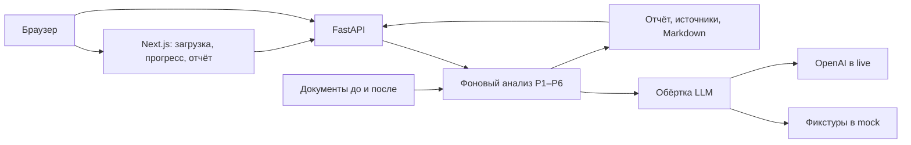
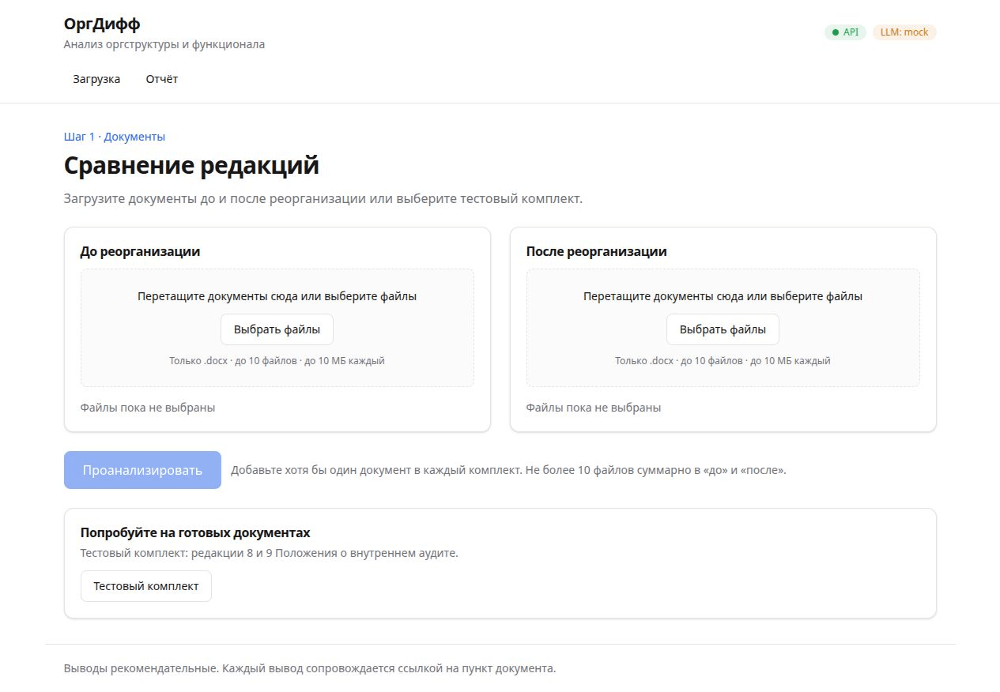
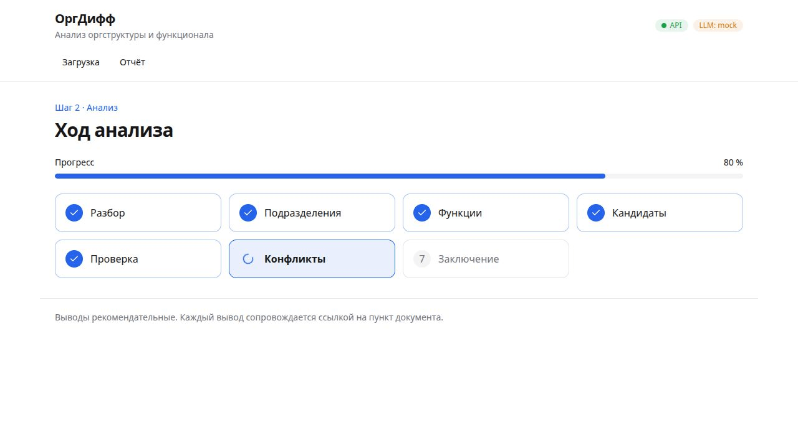
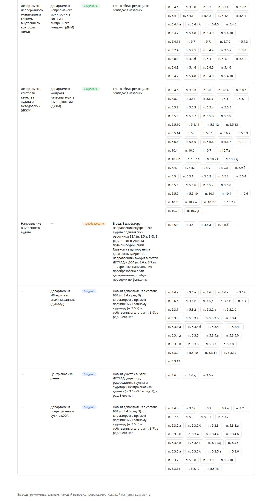
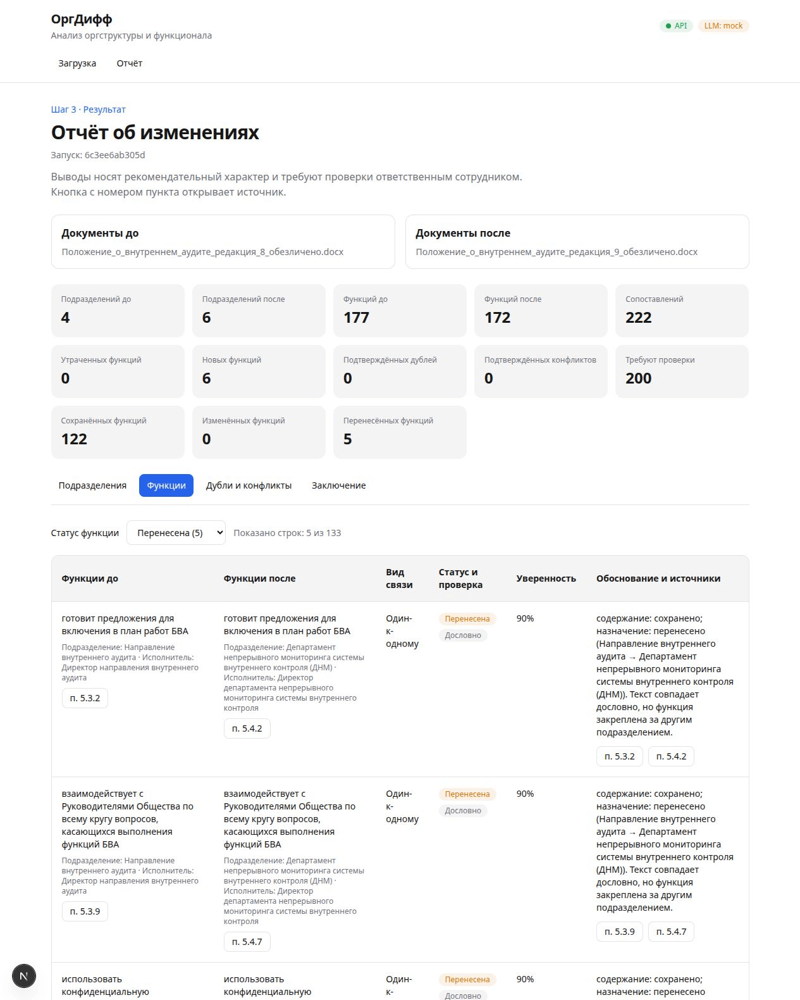
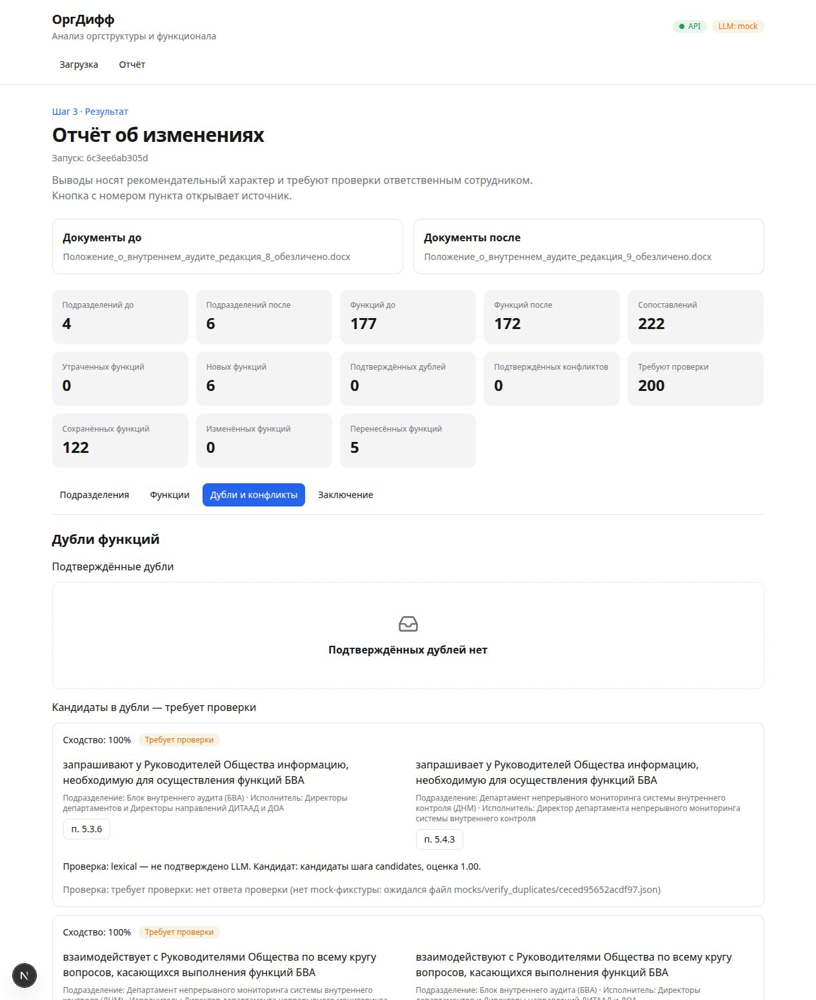
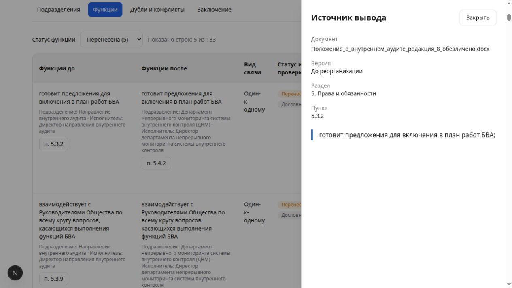
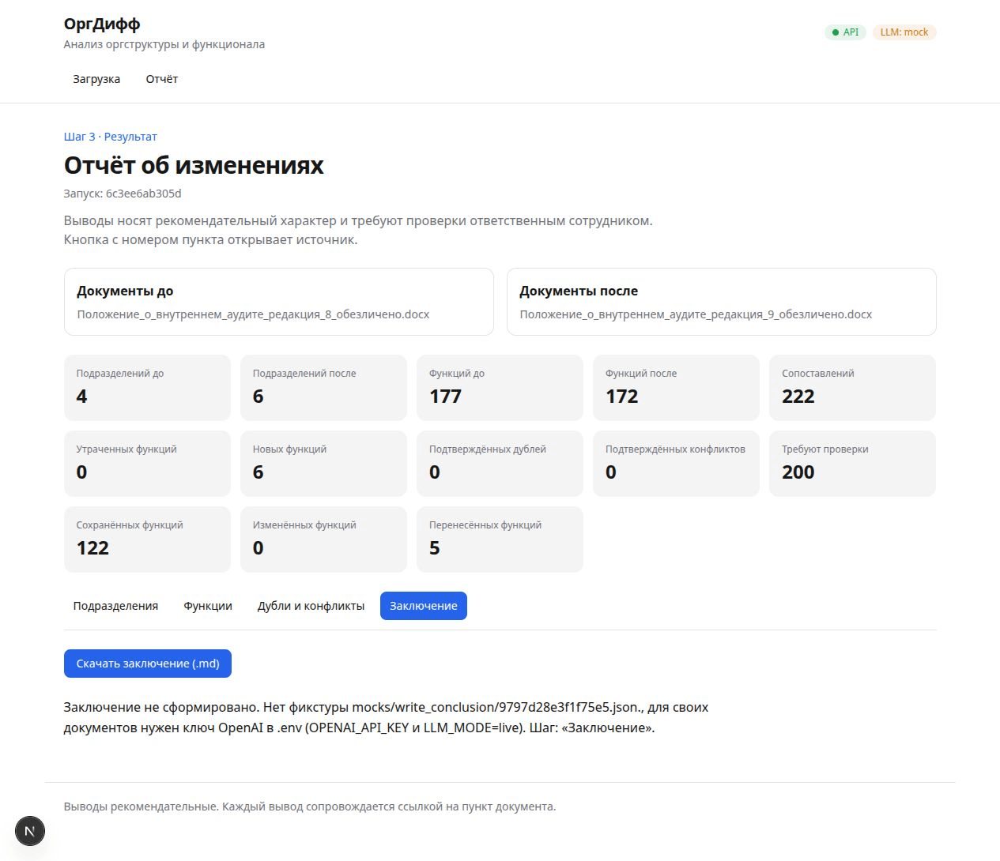
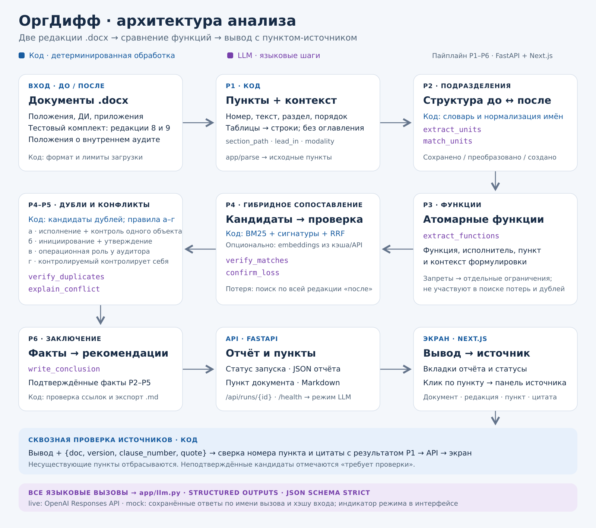

# 1. Название проекта

**ОргДифф — ИИ-агент анализа организационной структуры и функционала.**

Кейс 11 HackAlem AI, 23.09.2026. [Задание организаторов](docs/case.md).

**Онлайн-адрес: [odl.kz](https://odl.kz/).** При проверке 23.09.2026 в 17:48 (+05:00) сервер вернул HTTP 403. Для проверки решения используйте локальный запуск ниже.

**Для локальной проверки нужен только Docker с Compose и Git. Ключ OpenAI, файл `.env` и установка Python/Node.js не требуются.** Запуск — три команды из раздела 7, затем кнопка «Тестовый комплект».

## 2. Краткое описание

ОргДифф помогает сотрудникам организационного развития и внутреннего аудита проверить,
как реорганизация меняет подразделения, функции и ответственность. Он сравнивает документы
«до» и «после», собирает изменения в отчёт и показывает подтверждающие пункты документов.
Это позволяет проверять возможные потери функций, пересечения обязанностей и потенциальные
конфликты интересов. Выводы носят рекомендательный характер; решение принимает специалист.

## 3. Что реализовано

1. **Изменения подразделений:** извлечение и сопоставление со статусами «сохранено», «преобразовано», «создано», «упразднено».
2. **Сопоставление функций:** таблица «до/после», сохранённые, изменённые, перенесённые, новые функции и возможные потери. Кандидаты, требующие проверки, отмечаются отдельно.
3. **Дубли и конфликты интересов:** поиск пересечений между подразделениями и правила несовместимых ролей исполнения и контроля. На тестовом комплекте найдены дубли; конфликтов интересов не найдено.
4. **Источники:** документ, редакция, пункт и цитата у находки. Код проверяет существование пункта и соответствие цитаты; кнопка источника открывает исходный текст.
5. **Заключение:** текст по проверенным находкам, рекомендации и скачивание отчёта в Markdown.

Есть загрузка своих `.docx`, фоновый анализ, экран прогресса и просмотр отчёта.
Без ключа воспроизводится тестовый комплект организаторов на сохранённых ответах модели.

## 4. Как работает решение

1. Нажмите **«Тестовый комплект»** либо загрузите документы в зоны «До реорганизации» и «После реорганизации» и нажмите **«Проанализировать»**.
2. Дождитесь завершения анализа на странице прогресса.
3. Просмотрите вкладки **«Подразделения»**, **«Функции»**, **«Дубли и конфликты»**, **«Заключение»**.
4. Откройте пункт-источник у находки и скачайте заключение.

| Шаг | Что выполняет код | Для чего используется LLM |
|---|---|---|
| P1. Разбор | Читает Word, выделяет пункты, таблицы и контекст | Не используется |
| P2. Подразделения | Нормализует названия и проверяет источники | Извлекает подразделения и сопоставляет преобразования |
| P3. Функции | Проверяет источники, вычисляет сигнатуры, отделяет запреты | Извлекает атомарные функции и исполнителей |
| P4. Сопоставление | Сравнивает одинаковые тексты с учётом контекста, отбирает кандидатов по лексической и векторной близости | Проверяет смысл сопоставлений, потерь и дублей |
| P5. Конфликты | Применяет правила несовместимых ролей и проверяет общий объект | Объясняет найденные кандидаты |
| P6. Заключение | Собирает проверенные факты, проверяет ссылки и формирует экспорт | Формулирует заключение и рекомендации |

Языковые вызовы проходят через `backend/app/llm.py` с OpenAI Responses API и строгими
JSON-схемами Structured Outputs. Номера пунктов, отсутствующие в документе, отбрасываются кодом.
В режиме `mock` сетевые вызовы заменены чтением сохранённых ответов; документы разбираются,
сопоставления проверяются и итоговый отчёт собирается при каждом запуске.

## 5. Технологии

| Часть | Технологии |
|---|---|
| Backend | Python 3.12, FastAPI, Pydantic, Uvicorn, python-multipart |
| Анализ | Стандартная библиотека Python для `.docx`, NumPy, собственные правила и поиск кандидатов |
| AI | OpenAI Python SDK, Responses API, Structured Outputs; модель из `OPENAI_MODEL`, по умолчанию `gpt-5.6-luna`; embeddings `text-embedding-3-small` |
| Frontend | Next.js 15, React 19, TypeScript 5, Tailwind CSS 4 |
| Сборка и проверка | Docker Compose, uv, npm; pytest, Ruff, ESLint, TypeScript |

Точные версии зависимостей зафиксированы в [backend/uv.lock](backend/uv.lock) и
[frontend/package-lock.json](frontend/package-lock.json). В mock ключ и доступ к OpenAI не нужны.

## 6. Архитектура проекта



| Путь | Назначение |
|---|---|
| `backend/app/parse/`, `prebuilt/` | Разбор Word и нормализация |
| `backend/app/units.py`, `functions.py`, `candidates.py`, `matching.py` | Подразделения, функции и сопоставления |
| `backend/app/duplicates.py`, `rules/conflicts.py` | Дубли и конфликты |
| `backend/app/conclusion.py`, `export_md.py` | Заключение и экспорт |
| `backend/app/llm.py`, `llm_schemas.py`, `prompts/`, `mocks/` | Вызовы модели, схемы, промпты и сохранённые ответы |
| `backend/app/pipeline.py`, `routers/runs.py`, `store.py` | Фоновый анализ, API и состояние запусков |
| `frontend/app/`, `frontend/components/` | Интерфейс и панель источника |
| `data/case11/` | Тестовые документы организаторов |

Frontend опрашивает состояние каждые 2 секунды. API: `POST /api/runs/demo` — тестовый комплект,
`POST /api/runs` — загрузка, `GET /api/runs/{id}` — статус, `/report` — отчёт,
`/clauses/{doc_id}/{clause_number}` — источник, `/report.md` — скачивание.
Состояние хранится в памяти; JSON-дампы записываются в `backend/runtime/runs/`,
в Docker — в том `backend_runs`. Автоматического восстановления запусков после перезапуска нет.

## 7. Установка и запуск

### Основной способ — Docker, без ключа

Установите Git и запустите Docker Desktop с Linux-контейнерами (Windows/macOS)
либо Docker Engine с плагином Compose v2 (Linux). Требуется Compose **2.24.0+**:
используется необязательный `env_file`. Порты **3000** и **8000** должны быть свободны.
Интернет нужен для первоначального скачивания образов и зависимостей.

Откройте терминал или PowerShell и выполните:

```text
git clone https://github.com/BAITC-Hacks/hack-ec659486-mua.git
cd hack-ec659486-mua
docker compose up --build
```

**Создавать `.env` и вводить ключ не нужно.** На чистом клоне включён `LLM_MODE=mock`.
Дождитесь `Application startup complete` у backend и `Ready` у frontend. Оставьте терминал открытым.

- **Приложение:** [http://localhost:3000](http://localhost:3000).
- **Проверка API:** [http://localhost:8000/health](http://localhost:8000/health) — `status: ok`, `llm_mode: mock`.
- **Описание API:** [http://localhost:8000/docs](http://localhost:8000/docs).

Для остановки нажмите `Ctrl+C`, затем выполните `docker compose down` из той же папки.
Повторный запуск: `docker compose up`.

Проверенное окружение: Ubuntu, Docker 29.1.3, Compose 2.40.3. Windows/macOS используют
те же команды; Docker должен работать в режиме Linux-контейнеров. Минимальное потребление
ОЗУ и диска не измерялось; проверочная машина имеет 16 ГБ ОЗУ. Место требуется
для Docker-образов, зависимостей и документов. Чистый клон проверен без ключа;
оба сервиса стали готовы за 171,3 секунды при наличии кэша базовых образов и зависимостей.
Время холодной сборки без кэша отдельно не измерялось.

### Запасной способ — без Docker

Нужны **uv** (проверено с 0.12.17), **Python 3.12** (uv может скачать его сам),
**Node.js 20+** и npm. Откройте два терминала **в папке клонированного репозитория**.

Терминал 1 — API:

```text
cd backend
uv sync --locked
uv run uvicorn app.main:app --host 127.0.0.1 --port 8000
```

Терминал 2 — интерфейс:

```text
cd frontend
npm ci
npm run dev
```

Дождитесь `Ready` и откройте [http://localhost:3000](http://localhost:3000).
Отдельная production-сборка для этого способа не нужна. Остановка — `Ctrl+C` в обоих терминалах.

### Настройки и live-режим

Для тестового комплекта этот шаг пропустите. При необходимости создайте файл `.env`
в корне проекта, скопировав содержимое [.env.example](.env.example) в текстовом редакторе.

| Переменная | По умолчанию | Назначение |
|---|---|---|
| `LLM_MODE` | `mock` | Сохранённые ответы; `live` включает обращения к OpenAI |
| `OPENAI_API_KEY` | пусто | Ключ, нужен только в live |
| `OPENAI_MODEL` | `gpt-5.6-luna` | Модель Responses API |
| `DATA_DIR` | `../data` | Путь к документам относительно backend; Docker задаёт `/app/data` |
| `RUNTIME_DIR` | `./runtime` | Файлы запусков; Docker задаёт `/app/runtime` |
| `CORS_ORIGINS` | `http://localhost:3000` | Разрешённые адреса интерфейса |
| `APP_VERSION` | `0.1.0` | Версия в `/health` |
| `NEXT_PUBLIC_API_URL` | `http://localhost:8000` | Адрес API для браузера, задаётся при сборке |
| `NEXT_PUBLIC_APP_NAME` | `ОргДифф` | Название приложения |
| `DOMAIN` | пусто | Для серверного развёртывания; локально не нужен |
| `NVIDIA_API_KEY` | пусто | Заготовка настройки; текущий продукт её не использует |

Для своих документов укажите `LLM_MODE=live` и `OPENAI_API_KEY`, затем перезапустите приложение.
Доступ к указанной модели должен быть у вашего аккаунта. В live нет скрытого перехода на mock.
Полный live-сценарий через интерфейс пока не подтверждён — ограничения в разделе 10.

Backend читает корневой `.env` и `backend/.env`; переменные терминала имеют приоритет.
При запуске без Docker нестандартные настройки frontend задавайте в `frontend/.env.local`;
Compose берёт их из корневого `.env` и передаёт при сборке.

### Если не запускается

| Симптом | Что сделать |
|---|---|
| `Cannot connect to the Docker daemon` | Запустить Docker Desktop или службу Docker и повторить запуск |
| `compose` не найден или ошибка `env_file` | Обновить Docker Desktop / плагин до Compose 2.24.0+; проверить `docker compose version` |
| `port is already allocated` / `EADDRINUSE` | Освободить порты 3000 и 8000, остановив другое приложение; затем повторить запуск |
| `LLM_MODE=live, но OPENAI_API_KEY пуст` | Для проверки вернуть `LLM_MODE=mock` в `.env` и окружении терминала |
| «API недоступен» | Открыть `/health` по адресу выше; проверить лог backend и дождаться его готовности |
| Ошибка скачивания образов / зависимостей | Проверить доступ в интернет и повторить `docker compose up --build` |
| «Тестовый комплект не найден» | Проверить, что клонирован весь репозиторий вместе с `data/case11/` и запуск выполняется из его корня |

## 8. Как проверить решение

Сценарий для жюри **без ключа OpenAI**:

1. Выполните основной запуск из раздела 7 и откройте [приложение](http://localhost:3000).
2. Убедитесь, что в шапке показано **`LLM: mock`**, API доступен.
3. Нажмите **«Тестовый комплект»**. Файлы выбирать не требуется: редакции 8 и 9 уже в репозитории.
4. Дождитесь завершения анализа и автоматического перехода к отчёту. Ожидаемый статус — **`done`**, пропущенных шагов нет.
5. Во вкладке **«Подразделения»** проверьте изменения с упоминаниями ДИТААД, ДОА и направления внутреннего аудита.
6. Во вкладке **«Функции»** найдите потери: контроль сроков выполнения графика проверки проектной командой (ред. 8, п. **5.3.4.б**) и доведение результатов консультационных услуг до руководителей Общества (ред. 8, п. **5.7.2**). Ещё три кандидата требуют проверки.
7. Во вкладке **«Дубли и конфликты»** откройте пример руководства и распределения обязанностей между работниками (ред. 9, пп. **5.4.1** и **5.5.1**). Конфликтов интересов на этом комплекте **0**.
8. Нажмите кнопку с номером пункта у находки. Откроется панель с документом, редакцией и исходным текстом.
9. Откройте **«Заключение»**, затем нажмите **«Скачать заключение (.md)»**. Ожидается файл с заключением и источниками.

Контрольные результаты тестового комплекта:

| Показатель | Значение |
|---|---:|
| Изменения подразделений | 6: сохранено 3, преобразовано 2, создано 1 |
| Сопоставления функций | 209 |
| Подтверждённые потери / кандидаты на проверку | 2 / 3 |
| Подтверждённые дубли | 12 |
| Конфликты интересов | 0 |

Статус `partial` означает неполный анализ: приложение сообщает причину и предлагает частичный
отчёт. На комплекте из проверенной версии ожидается `done`.

Необязательная автоматическая проверка из папки `backend/`, после `uv sync --locked`:

```text
uv run pytest -q tests/test_e2e_mock.py
```

Проверенная версия приложения — тег `green-17-final` (коммит `e575847`); последующие
изменения README собраны в `main`. Backend: Ruff и **206 passed**, включая два сквозных
теста. Frontend: ESLint, TypeScript и production-сборка Next.js — PASS.

В чистом Docker-запуске подтверждены `done`, отсутствие пропущенных шагов,
551 уникальный источник и полные цитаты в 542 пунктах. Markdown, скачанный через
frontend, побайтно совпадает с экспортом API. В браузере проверены кнопка
«Тестовый комплект», вкладки, фильтры, панель источника и фактическое скачивание файла.
Запасной запуск через uv и npm также проверен. Для изоляции использовались отдельные
локальные порты; продуктовый код и данные не менялись.

Это автоматизированная проверка. Независимый ручной прогон вторым участником
на его ноутбуке отдельно не заявляется.

### Снимки проверенного сценария

Снимки настоящего mock-прогона; происхождение и контрольные суммы —
[capture-notes.md](docs/img/capture-notes.md).










## 9. Данные и интеграции

Входные документы предоставлены организаторами и обезличены:

- [Положение о внутреннем аудите, редакция 8](data/case11/Положение_о_внутреннем_аудите_редакция_8_обезличено.docx) — «до»;
- [Положение о внутреннем аудите, редакция 9](data/case11/Положение_о_внутреннем_аудите_редакция_9_обезличено.docx) — «после».

В `backend/app/mocks/` ответы хранятся по имени вызова и хэшу входа. Итоговое демо использует записанные S15 ответы `gpt-5.6-luna` из коммита `bb7ddd3`: извлечение подразделений и функций, сопоставления, проверку потерь и дублей, заключение и кэш embeddings. Происхождение, число вызовов и повторный mock-прогон описаны в [S15](status/agents/S15.md). При интеграции конфликтующие записи выбраны из этого согласованного набора; дополнительные записи предыдущего прогона сохранены для остальных входов.

Ручные и черновые фикстуры для модульных тестов также остаются в репозитории. В частности, `write_conclusion` для `demo_report.json` — ручная фикстура S14, а старые fixtures функций создавались правилами S09. Их наличие не означает, что все JSON-файлы репозитория получены от модели.

`backend/app/mocks/demo_report.json` и `frontend/lib/fixtures/report.ts` — отдельно подготовленная демонстрационная фикстура с цитатами, а не результат текущего API-прогона. В ней, например, изменён состав ДККМ, есть кандидаты по контролю устранения нарушений и пересечению анализа непрерывного аудита. Кнопка «Тестовый комплект» запускает реальный pipeline с mock-ответами и выдаёт результат раздела 8. Подменять эти два отчёта при демонстрации нельзя.

Внешняя интеграция продукта — OpenAI Responses API в live; имя модели берётся из окружения. В mock обращения к OpenAI не нужны. Других подключённых источников нормативных данных и корпоративных систем нет.

## 10. Ограничения

- Поддерживается только `.docx`: до 10 файлов суммарно, до 10 МБ каждый, минимум один документ в каждой версии. PDF и Excel отклоняются.
- Mock рассчитан на сохранённые входы тестового комплекта. Для произвольных документов нужны live-режим и ключ.
- В демо остаются три кандидата на проверку, а конфликтов интересов не найдено. Это не доказывает отсутствие всех возможных проблем.
- Проверка пункта и цитаты подтверждает источник, но не гарантирует правильность смысловой интерпретации. Качество на других комплектах не измерялось.
- Нет сравнения с НПА, стандартами и другими операторами, авторизации и редактирования отчётов. После перезапуска API старые запуски автоматически не восстанавливаются.
- API ограничивает анализ 180 секундами. Служебная запись live-фикстур заняла 824 секунды с увеличенными таймаутами; полный live-прогон через интерфейс не подтверждён.

### Дальнейшее развитие

Планируем развивать ОргДифф в систему поддержки комплексного организационно-функционального
аудита: добавить PDF/Excel и реестр редакций; сверку положений подразделений с ДИ сотрудников;
связь функций с процессами и матрицами ответственности; проверку предоставленных нормативных
требований; сравнение вариантов целевой структуры; повторные проверки и учёт устранения замечаний.

Масштабирование предполагает пилот на одном подразделении, затем охват организации,
настройку справочников и правил под её документы, разграничение доступа и интеграции
с кадровыми системами и документооборотом. Это план будущих версий.

## 11. Ссылка на deployed-версию

**Онлайн-адрес ОргДифф: [odl.kz](https://odl.kz/).** При проверке 23.09.2026 в 17:48 (+05:00) сервер вернул HTTP 403; работоспособность публичного экземпляра не подтверждена.

Для воспроизводимой проверки на своей машине используйте локальный запуск из раздела 7.

## 12. Заранее подготовленные компоненты и AI-инструменты

Раскрытие подготовленных компонентов:

| Компонент | Где | Происхождение и назначение |
|---|---|---|
| Каркас FastAPI + Next.js + Docker Compose, CI, mock-режим LLM, служебные команды | `backend/app/main.py`, `config.py`, `llm.py`, первая версия `frontend/app/layout.tsx`, `docker-compose.yml`, `scripts/`, `.github/` | Подготовлен командой 22.09.2026; импортирован [коммитом d7aa4d3](https://github.com/BAITC-Hacks/hack-ec659486-mua/commit/d7aa4d3359d633331e3c2446c962a6923b493534) 23.09 в 13:58 (+05:00). Инфраструктура без готового решения кейса |
| Утилиты разбора Word и нормализации | [lib_docx.py](backend/app/prebuilt/lib_docx.py), [lib_normalize.py](backend/app/prebuilt/lib_normalize.py) | Внутренние утилиты команды, написаны ранее для других задач; происхождение и область — [NOTICE.md](backend/app/prebuilt/NOTICE.md) |
| Тестовый комплект | [data/case11/](data/case11/) | Документы организаторов кейса 11 |
| Спецификация, правила и промпты сессий | [спецификация](docs/spec-case11.md), [AGENTS.md](AGENTS.md), [prompts/](prompts/), [промпты LLM](backend/app/prompts/) | Подготовлены и дорабатывались 23.09 для выбранного кейса; это раскрываемые материалы разработки |

В соревновательной части 23.09 разрабатывались обёртка разбора с контекстом, логика P2–P6, схемы ответов, API запусков, интерфейс отчёта и тесты. Итоговый проверенный сценарий и его ограничения приведены в разделах 8–10.

| AI-инструмент | Подтверждённые области работы | Основание |
|---|---|---|
| OpenAI Codex | Фикстуры S02, интерфейс S03/S06/S07/S12, схемы S13, заключение S14, интеграционные исправления, S17–S20 | Отчёты [status/agents/](status/agents/) и трейлеры `Co-authored-by: Codex` в истории Git |
| Claude Code | Контракт S01, разбор S04, подразделения S05, pipeline/API S08, функции S09, сопоставление S10, дубли и конфликты S11, запись фикстур S15 | Инструмент указан в соответствующих отчётах [status/agents/](status/agents/) |

Реестр «сессия → инструмент → файлы → проверка»: [docs/ai-usage.md](docs/ai-usage.md). Журнал сверен с итоговой интеграцией; атрибуция опирается на отчёты и историю коммитов. Происхождение записанных ответов и ручных тестовых данных отдельно раскрыто в разделе 9.

## 13. Команда

В рабочих материалах участники обозначены A и B:

| Участник | Ответственность |
|---|---|
| A | Архитектура и контракт, backend, документы, анализ и фикстуры |
| B | Frontend, интеграция, проверки, документация и демонстрация |

Владение файлами — [матрица сессий](docs/sessions.md); фактические изменения — история Git
и [отчёты](status/agents/).
